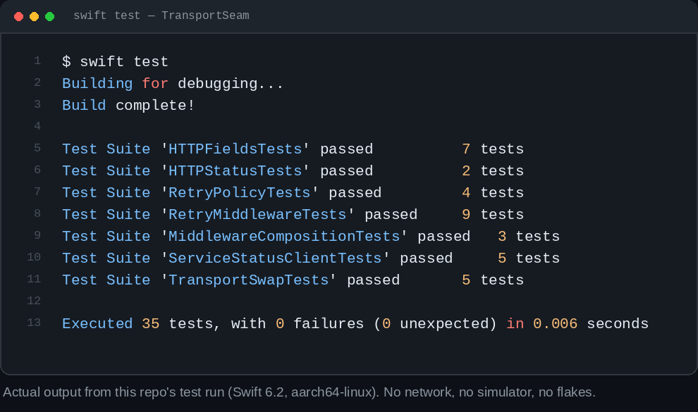
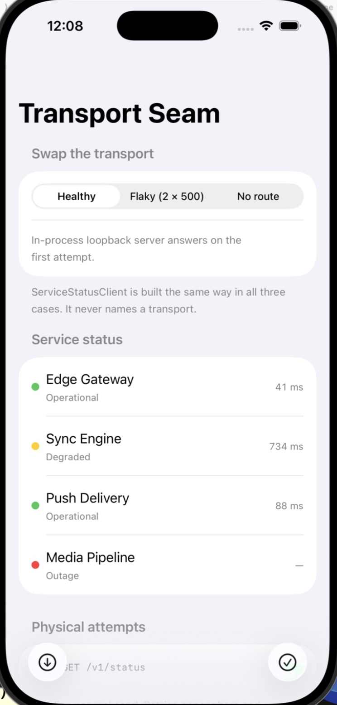
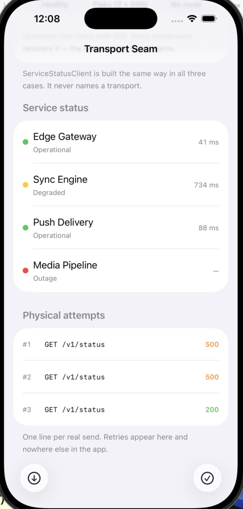

# TransportSeam

A working demo of one idea: **put a seam between your feature code and whatever HTTP stack you happen to be using today.**

Swift's new [Networking Workgroup](https://www.swift.org/networking-workgroup/) is building a unified stack — shared I/O primitives, common protocol implementations, and a modern HTTP client/server API on structured concurrency. None of it is something you adopt this sprint. But the cost of adopting it later is being decided right now, by how many of your files know the words `URLSession` and `URLRequest`.

This repo is the small, working version of that argument.


---

## What's here

| Path | What it is |
|------|------------|
| `Sources/TransportSeam` | The seam: currency types, the one-method transport protocol, middleware, retry policy, in-process fixtures, and one feature client written against all of it. |
| `Sources/TransportSeamURLSession` | The only file in the package that knows `URLSession` exists. ~70 lines, including error translation. |
| `Sources/TransportSeamUI` | A SwiftUI screen that swaps the transport under a live feature and shows every physical attempt. |
| `Tests/TransportSeamTests` | 35 tests, including the ones that run the *same* feature assertions over two structurally different transports. |
| `Demo.xcodeproj` | The runnable iOS app. Consumes the package from this same checkout. Verified on Simulator — see below. |
| `Demo/Screenshots` | Real captures from that Simulator run. |

## The whole idea, in one type

```swift
public protocol HTTPTransport: Sendable {
    func send(_ request: HTTPRequest) async throws -> HTTPResponse
}
```

One method, two of your own types, no associated types. Every extra requirement here is another thing a future transport has to satisfy.

The feature layer's stored properties are the actual claim:

```swift
public struct ServiceStatusClient: Sendable {
    private let baseURL: URL
    private let transport: any HTTPTransport
    // No URLSession. No URLRequest. Nothing that has to change
    // when the stack underneath does.
}
```

## The test that proves it

```swift
private func assertClientBehaviour(over transport: any HTTPTransport) async throws {
    let client = ServiceStatusClient(baseURL: testBaseURL, transport: transport)
    let statuses = try await client.fetchStatuses()

    XCTAssertEqual(statuses.map(\.id), ["edge", "sync", "push", "media"])
}

func testScriptedTransportSatisfiesTheContract() async throws {
    try await assertClientBehaviour(over: ScriptedTransport(responses: [StatusFixtures.okResponse]))
}

func testLoopbackTransportSatisfiesTheSameContract() async throws {
    let routes = [LoopbackTransport.Route(method: .get, path: "/v1/status"): StatusFixtures.okResponse]
    try await assertClientBehaviour(over: LoopbackTransport(routes: routes))
}
```

If that suite ever needs a per-transport branch, the seam has leaked and the migration has stopped being free.



That image is a typeset rendering, not a screenshot. Here is the genuine tail of the run it summarises:

```text
Test Suite 'TransportSwapTests' passed at 2026-07-30 22:49:35.545
	 Executed 5 tests, with 0 failures (0 unexpected) in 0.001 (0.001) seconds
Test Suite 'debug.xctest' passed at 2026-07-30 22:49:35.545
	 Executed 35 tests, with 0 failures (0 unexpected) in 0.109 (0.109) seconds
Test Suite 'All tests' passed at 2026-07-30 22:49:35.545
	 Executed 35 tests, with 0 failures (0 unexpected) in 0.109 (0.109) seconds
```

## Two details worth stealing

**Retries respect idempotency, not optimism.** `RetryMiddleware` refuses to re-send a request that isn't safely repeatable, regardless of how transient the failure looked. A duplicated `GET` is free; a duplicated `POST /payments` is a support ticket. A `POST` opts in by carrying an idempotency key.

**Running out of attempts doesn't invent a new error.** The caller gets the last real response or the last real error. A synthetic `retriesExhausted` throws away the only diagnosis anyone wanted.

## How to run it

```bash
git clone https://github.com/rajatslakhina/transport-seam-article-demo.git
cd transport-seam-article-demo
swift test          # 35 tests, no network required
open Demo.xcodeproj # pick any iOS Simulator, then Build & Run
```

No second repo to fetch, no package registry, no setup. `Demo.xcodeproj` references the package in this same folder as a local Swift Package dependency.

In the app: pick a transport with the segmented control, hit **Send GET**, and watch the "Physical attempts" section. The *flaky* transport fails twice with `500` before succeeding — the retry ladder shows up there and nowhere else, because the feature code never learns it happened.

## Verification status — read this before trusting the repo

Being specific about what was and wasn't checked:

- ✅ `swift build` and `swift test` pass. **35 tests, 0 failures**, Swift 6.2 toolchain, Swift 6 language mode (strict concurrency), `aarch64-unknown-linux-gnu`.
- ✅ `TransportSeam` and `TransportSeamURLSession` compile cleanly.
- ✅ **Built and run on a real iOS Simulator.** Xcode 26.3, iPhone 17 Pro, iOS 26.3. `Demo.xcodeproj` opened cleanly, resolved `TransportSeam` as a local package from `relativePath = "."`, compiled with no errors, and launched. Both screenshots below are real captures of that session, not mockups.
- ✅ The demo's core behaviour was exercised live, not just launched: the *Healthy* transport returns all four services on the first attempt, and the *Flaky* transport records **three physical attempts — 500, 500, 200** — while the feature layer still hands back the same four services. That is the article's whole claim, visible on device.





- ✅ The SwiftUI layer also got a line-by-line review against the failure classes that have bitten this project before: no force-unwraps anywhere in `Sources/` (checked by script), a `@MainActor` model with a `nonisolated init` so SwiftUI's nonisolated `@State` initialisation type-checks under Swift 6, all list rendering over `Identifiable` values, and a `project.pbxproj` that avoids the `.executableTarget`-as-app pattern (a synthesized bundle identifier that isn't committed to git, which crashes on launch) in favour of a committed `PRODUCT_BUNDLE_IDENTIFIER`.
- ⚠️ One honest limit remains: the package's **unit tests** run on Linux, so `TransportSeamUI` is never type-checked by `swift test` — its verification is the Simulator run above plus review, not CI.

If it doesn't build first time in your Xcode, that's a genuine gap and an issue is welcome.

## Requirements

Swift 6.0+ toolchain, iOS 17+ for the demo app.

---

Article: [URLRequest Is Not a Domain Type — and Swift's New Networking Stack Is About to Prove It](https://medium.com/@er.rajatlakhina/urlrequest-is-not-a-domain-type-and-swifts-new-networking-stack-is-about-to-prove-it-9c01e5a6beeb)

Written as the companion repo to a piece on what the Swift Networking Workgroup's unified stack actually asks of iOS teams today.
